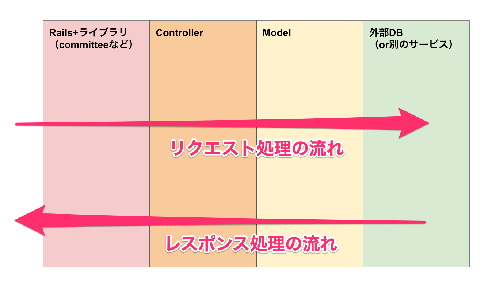
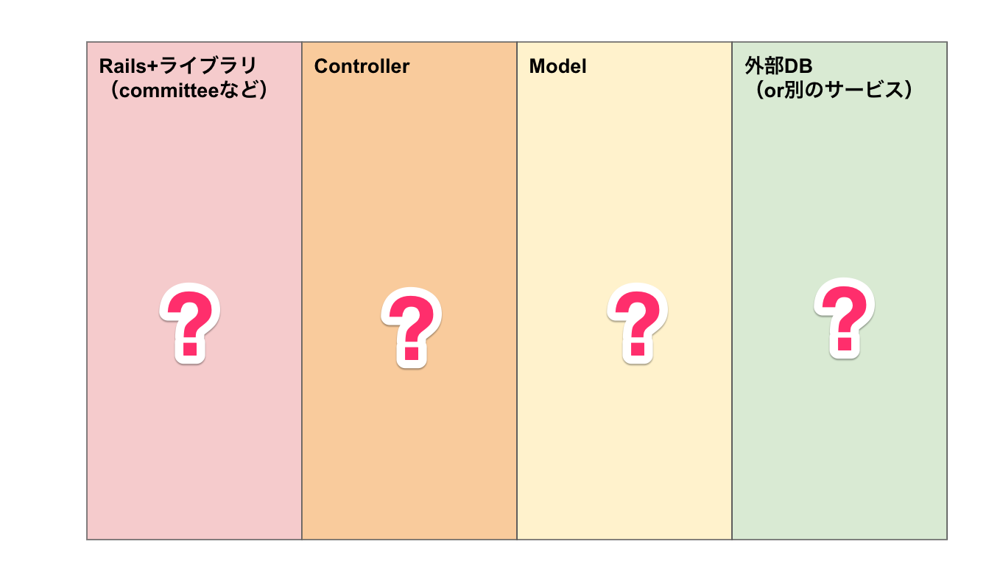
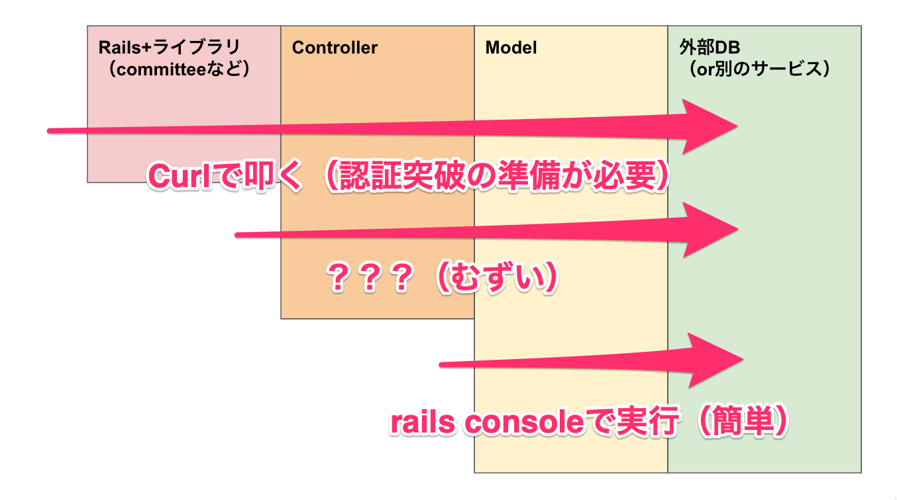
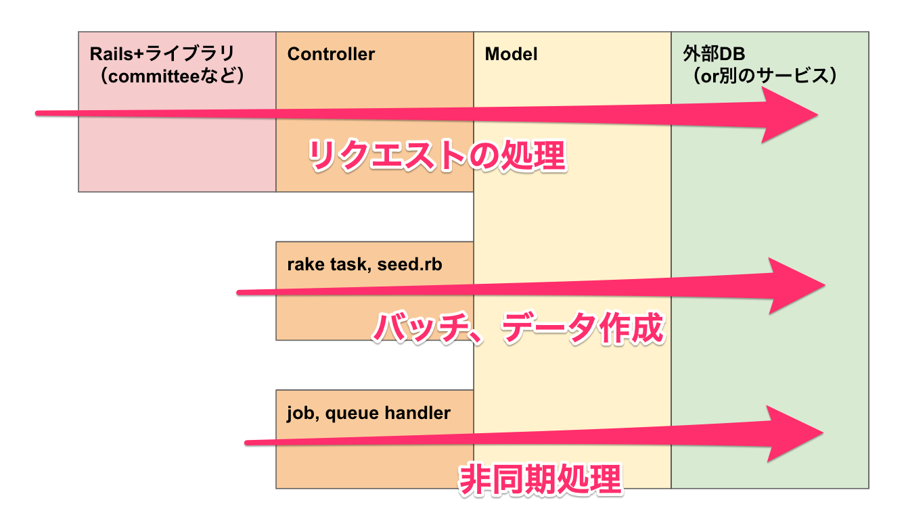
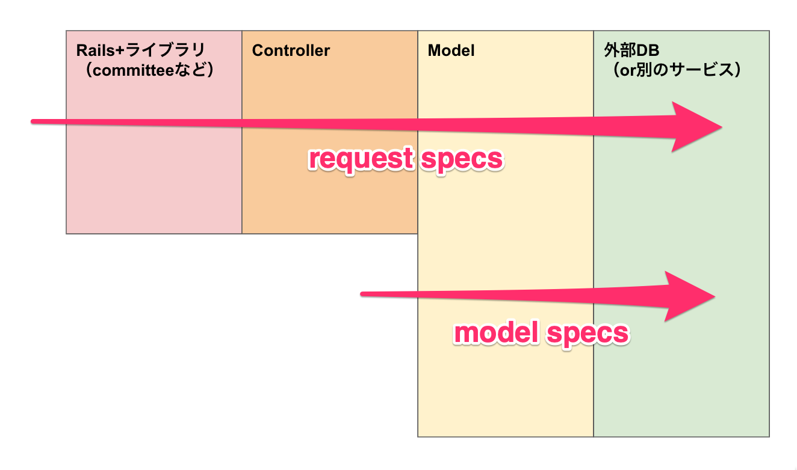
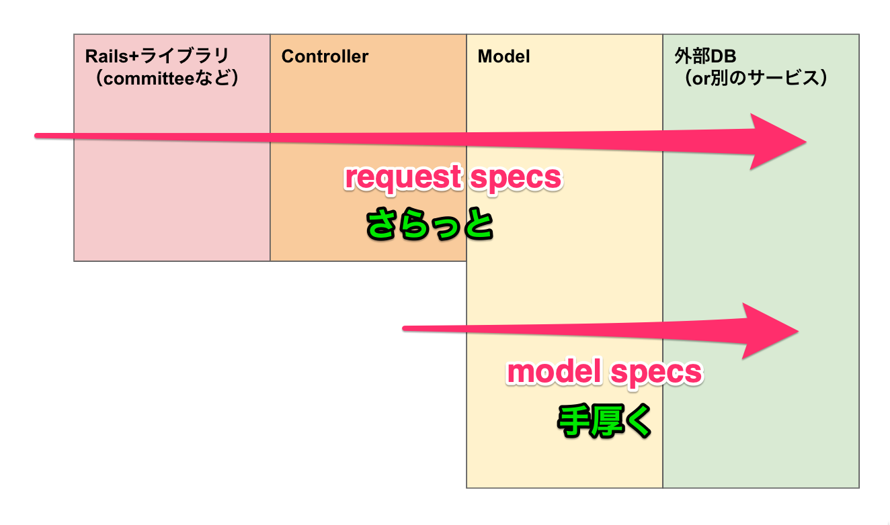
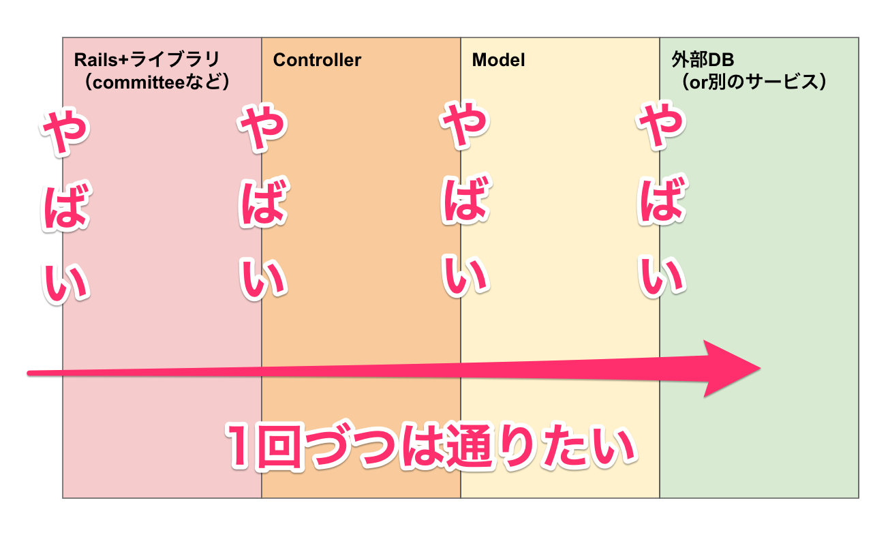

## 今更のようにrailsのfat controllerの話をしてみる（仮）

2022/06/13

黒木 慎介

---

## この発表の目的

- 🙆 書き方のついての議論を活発にしてほしいから、まずは私が考えてる事を話すね
- 🙅 ~~おまえたちのコードはクソだ、俺が良い書き方を教えてやる~~

---

## この発表の主張

- controllerにロジックを書くのをやめよう

---

## まずはrailsの処理の流れをおさらい

---

## まずはrailsの処理の流れをおさらい

- たまねぎ(WSGI)でも円(clean architecture)でも良いけど
- この発表ではこの図で考えます

---

## ある日のこと

- 「ステージング環境でAPIがエラー出してるんですけど」
  - （開発環境では大丈夫だったんだけどなー

---

## デバッグ

---

## 問題の切り分け

---

## 問題の切り分け

- controllerの単体実行は難しい
  - そもそも私達はcontrollerをnewするコードを書かない
    - railsのやくめ
  - 入力がparams（sessionとかも）で、出力がrender

---

## 問題の切り分け

- だが私達は、controllerに処理を長く書いてしまうことがある
- rails consoleからだとどう再現する？
- controllerのコードをコピペして再現
  - つらい
- controllerにコードを書かないようにしたい！

---

## 他にもこんなに便利

---

## controllerとは

- railsが「HTTPリクエストの事情」を解釈して抽象度を上げてcontrollerに渡す
- ならばcontrollerは「rails（のリクエスト処理）の事情」を解釈して抽象度を上げてmodelに渡すと考えたい

---

## modelとは

- ずっとmodelって言ってるけど、別にmodelじゃなくていい
  - 非ActiveRecordのmodel
  - service object（黒木はこれが多い）
  - command（破壊的）/query（読み込みだけ）
- なんでもいいのでとにかくcontrollerに書かない
  - 2行書いたらもう切り離したい

---

## modelとは

- 全部service objectじゃなくて良いと思ってる
  - 主役のmodelが決まってて登場人物少なめなら主役のメソッドで

---

## テストの書き方

---

## テストの書き方

---

## バグは境界に潜む

---

## バグは境界に潜む

- 動的型付けのrubyでは特にクラス同士の連携ミスやインターフェースの食い違いは起きがち
- 引数・戻り値の有無(null)とかがあるならそのパターンごとに1回通るテストがしたい

---

## おしまい

- controllerにロジックを書きたくない話をしました
- あなたはどう思いますか？